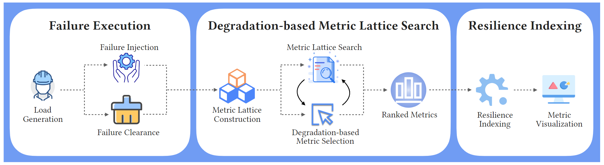
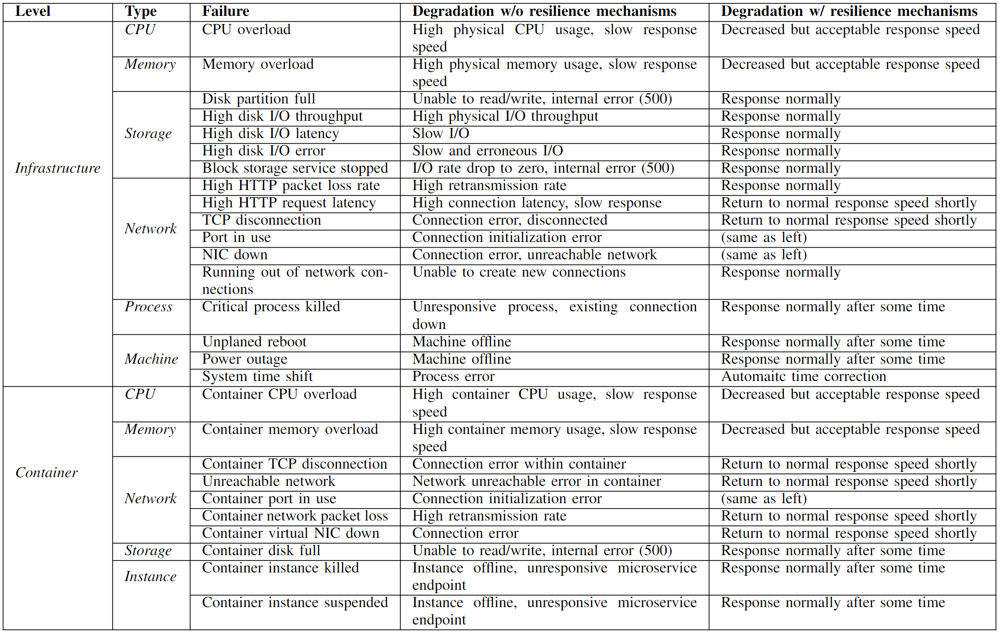
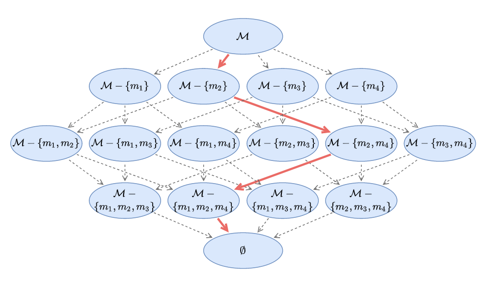

# REST: An Adaptive Resilience Testing Framework for Microservice Systems

This repository accompanies our FSE23 submission `REST: An Adaptive Resilience Testing Framework for Microservice Systems`.

### Architecture


### Motivating Examples
The following table shows the motivating examples of our comparison between resilient and unresilient deployments on Kubernetes.



### Steps to run
- Install the requirements. 
- The `REST` class provides an interface for resilience evaluation. Here's the code sample:
```python
f_cont = <contribution function> # select a contribution measure from rest/model/distance.py
rest = REST(f_cont = <contribution function>)
r = rest.eval(testId, metricMetadata, normalInterval, faultyInterval, metrics) # the resilience value
```
- The dataset pkl file is organized by `(testId, metricMetadata, normalInterval, faultyInterval, metrics)`.

### Results
The output of REST is a float value indicating the resilience index of the microservice system. 


